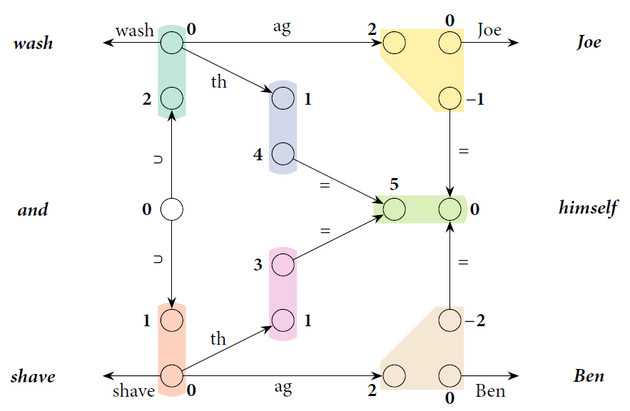
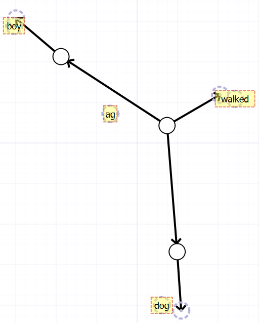

# Lambekseq



<font face="Times" size="3"><i>"Everyone who failed Greek or Latin hates it." </i></font>

<br>

This package is for proving theorems in Categorial grammars (CG) and constructing semantic graphs, i.e., semgraphs on top of that.  

Three CG calculuses are supported here (see below). A "proof" is simply a set of atom links, abstracting away from derivaiton details.


## Requirements
Add the path to the package to `PYTHONPATH`. None of the below packages is needed to use the theorem proving facility.

Semantic graphs derive from digraph:
- [networkx](https://networkx.github.io/)  

For graph visualization we use
- [pydot](https://github.com/xflr6/graphviz) (required by `networkx`)
- [Graphviz](https://www.graphviz.org/)
- [python-graphviz](https://github.com/xflr6/graphviz)
- [dot2tex](https://dot2tex.readthedocs.io)


## Background
This package is used for the author's PhD thesis in progress.

### Categorial grammars:
- Associative Lambek Calculus Allowing Empty Premises ([Lambek 1958](https://www.cs.cmu.edu/~fp/courses/15816-f16/misc/Lambek58.pdf))
- Proof Net for Lambek Calculus based on Cyclic Multiplicative Linear Logic ([Pentus 2010](http://www.aiml.net/volumes/volume8/Pentus.pdf))
- Continuized Combinatory Categorial Grammar ([Barker and Shan 2014](https://www.oxfordscholarship.com/view/10.1093/acprof:oso/9780199575015.001.0001/acprof-9780199575015))
- Basic Displacement Calculus/Continuized Lambek Calculus ([Morrill et al 2010](https://link.springer.com/article/10.1007/s10849-010-9129-2))

### Semantic graphs:
- Abstract Meaning Representation ([Banarescu et al 2013](https://www.aclweb.org/anthology/W13-2322/);  
see also https://github.com/amrisi/amr-guidelines/blob/master/amr.md)
- Hybrid Logic Dependency Semantics ([Baldridge and Kruijff 2002](https://www.aclweb.org/anthology/P02-1041/); [White 2006](https://link.springer.com/article/10.1007/s11168-006-9010-2))


## Theorem Proving
To prove a theorem, use `atomlink` module. For example, using Lambek Calculus to prove `np np\s -> s`.
```
>>> import lambekseq.atomlink as al

>>> con, *pres = 's', 'np', 'np\\s'
>>> con, pres, parser, _ = al.searchLinks(al.LambekProof, con, pres)
>>> al.printLinks(con, pres, parser)
```
This outputs
```
----------
s_0 <= np_1 np_2\s_3

(np_1, np_2), (s_0, s_3)

Total: 1
```

You can run `atomlink` in command line. The following finds proofs for the **first** themorem in `input.json`, using abbreviation definitions in `abbr.json` and Contintuized CCG.

```
$ python atomlink.py -j input.json -a abbr.json -c ccg
```
Theorem `["s", "qpd", "vp/s", "qpd", "vp"]` (the first item is the **conclusion**, the rest the **premises**) is thus proved as follows:
```
<class 'lambekseq.cntccg.Cntccg'>
----------
s_0 <= (s_1^np_2)!s_3 (np_4\s_5)/s_6 (s_7^np_8)!s_9 np_10\s_11

(np_10, np_8), (np_2, np_4), (s_0, s_3), (s_1, s_5), (s_11, s_7), (s_6, s_9)

Total: 1
```

Run `python atomlink.py --help` for details.

## Semantic Parsing
Use `semcomp` module for semantic parsing. You need to define graph schemata for parts of speech as in `schema.json`.
```
>>> from lambekseq.semcomp import SemComp
>>> SemComp.load_lexicon(abbr_path='abbr.json',
                         vocab_path='schema.json')
>>> ex = [('a', 'ind'), ('boy', 'n'), 
          ('walked', 'vt'), ('a', 'ind'), ('dog', 'n')]
>>> sc = SemComp(ex, calc='dsp')
>>> sc.unify('s')
```

Use `graphviz`'s `Source` to display the semgraphs constructed from the input:
```
>>> from graphviz import Source
>>> Source(sc.semantics[0].dot_styled)
```
This outputs  


You can inspect the syntax behind this parse:
```
>>> sc.syntax[0].con, sc.syntax[0].pres
('s_0', ['np_1/n_2', 'n_3', '(np_4\\s_5)/np_6', 'np_7/n_8', 'n_9'])

>>> sc.syntax[0].links
frozenset({('n_2', 'n_3'), ('s_0', 's_5'), ('np_1', 'np_4'), ('np_6', 'np_7'), ('n_8', 'n_9')}) 
```

See [`demo/demo.ipynb`](demo/demo.ipynb) for more examples.

You can export semgraphs to `tikz` code that can be visually edited by [TikZit](https://tikzit.github.io/)



```
>>> print(sc.semantics[0].tikz)
\begin{tikzpicture}
\begin{pgfonlayer}{nodelayer}
        \node [style=node] (i1) at (-1.88,2.13) {};
        \node [style=none] (g2u0) at (-2.99,3.07) {};
        \node [style=node] (i0) at (0.99,-2.68) {};
        \node [style=none] (g5u0) at (1.09,-4.13) {};
        \node [style=node] (g3a0) at (0.74,0.43) {};
        \node [style=none] (g3u0) at (2.05,1.19) {};
        \node [style=none] (0) at (-3.04,2.89) {boy};
        \node [style=none] (1) at (0.61,-4.00) {dog};
        \node [style=none] (2) at (-0.66,0.72) {ag};
        \node [style=none] (3) at (0.63,-0.77) {th};
        \node [style=none] (4) at (2.42,1.09) {walked};
\end{pgfonlayer}
\begin{pgfonlayer}{edgelayer}
        \draw [style=arrow] (i1) to (g2u0.center);
        \draw [style=arrow] (i0) to (g5u0.center);
        \draw [style=arrow] (g3a0) to (i1);
        \draw [style=arrow] (g3a0) to (i0);
        \draw [style=arrow] (g3a0) to (g3u0.center);
\end{pgfonlayer}
\end{tikzpicture}
```
